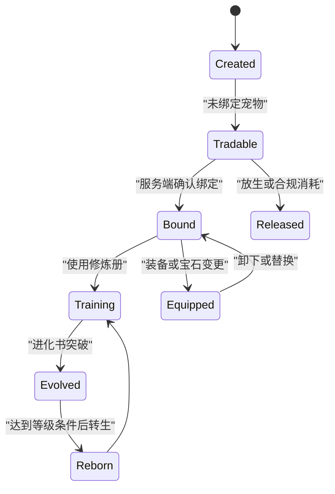

# 宠物系统设计

## 1. 目的与状态

本文把外部资料转换为适合本项目的实现设计。它定义目标模型、数据边界和实施顺序；具体成长数值见 [规则与数值](./规则与数值.md)，原始资料和样本见 [资料目录](./资料目录.md)。

当前项目仍运行旧宠物 ID 模型。本设计中的表、实例字段和接口边界均为重做目标，除非明确标为“现有实现”，否则不得误认为已经上线。

| 状态 | 含义 | 实现处理 |
| --- | --- | --- |
| 现有实现 | 当前代码或旧玩家数据已依赖的行为 | 迁移前保持兼容并写测试 |
| 设计基线 | 已整理为本项目的目标规则 | 可进入模块设计与测试，但仍需先完成 P0 数据核验 |
| 资料参考 | 截图、玩家表或样本推导 | 只能配置化保存，不能直接消耗玩家资产 |
| 待确认 | 资料冲突、字段缺失或语义不完整 | 禁止写死为正式玩法 |

## 2. 当前与目标

| 主题 | 当前实现 | 目标设计 |
| --- | --- | --- |
| 所有权 | `owned_pets_json` 保存旧宠物数字 | `pet_instances` 保存唯一实例与所属账号 |
| 进度 | 等级、额外技能、贴纸分散在 JSON 字段 | 以实例为中心保存等级、进化、转生、资质、技能、装备和版本 |
| 模板 | `宠物目录.js` 同时承担名称、领取、技能、精灵映射 | 模板、资源映射和运营投放策略分离 |
| 属性 | 旧线性属性与战斗数据耦合 | 服务端生成可审计的原始值与上限后快照 |
| 资产操作 | 旧接口按宠物 ID 操作 | 实例 ID、会话身份、`requestId`、版本号和事务 |
| 资源 | 部分数字隐含行走或战斗 CHJ | 四类 CHJ 显式字段，允许缺失，不使用推导 |

## 3. 目标领域模型

### 3.1 宠物模板

模板是运营与玩法配置，不属于任何玩家。建议由版本化配置或独立表维护：

```json
{
  "templateId": "soul-lion-king",
  "canonicalName": "狮子王",
  "aliases": [],
  "category": "soul",
  "releaseLevel": 1,
  "tradePolicy": "tradable_before_bind",
  "qualificationRuleVersion": "2026-07-draft-1",
  "baseQualifications": {
    "hp": 2285,
    "attack": 2485,
    "speed": 866,
    "mana": 866,
    "defense": 1859
  },
  "innateSkillIds": ["pet_lion"],
  "defaultSkillIds": ["toughness_a", "power_a", "bloodthirst_a"],
  "spriteRefs": {
    "walkChj": "486",
    "attackChj": "487",
    "costumeWalkChj": null,
    "costumeAttackChj": null
  }
}
```

示例只说明字段形态，未授权将样本数值直接投入生产。CHJ 引用使用字符串，以兼容 `388b` 等非整数资源值。每个模板至少需要正式名称、稳定主键、分类、来源证据、规则版本和资源映射；名称别名不能作为查询或写库主键。

### 3.2 宠物实例

实例是玩家实际拥有的一只宠物。即使两只宠物同模板、同名、同资质，也必须具有不同 `instanceId`。

```json
{
  "instanceId": "pet_i_opaque_id",
  "ownerAccountId": "server-account-id",
  "templateId": "soul-lion-king",
  "legacyPetId": 486,
  "displayName": "狮子王",
  "stateVersion": 1,
  "boundAt": null,
  "tradeLocked": false,
  "level": 1,
  "rebirthCount": 0,
  "normalExp": 0,
  "evolution": {},
  "qualifications": {},
  "allocatedPoints": {},
  "skillSlots": {},
  "equipmentIds": [],
  "snapshot": {}
}
```

`legacyPetId` 只为兼容旧存档而存在。它不能决定动画、技能、分类或新模板主键。实例创建后应固化模板版本与出生资质快照，避免运营改模板导致历史宠物被静默改数值。

### 3.3 资产与记录

重做后需要将高风险资产从玩家 JSON 中拆出。建议最少具备以下持久化边界：

| 数据 | 责任 | 关键字段 |
| --- | --- | --- |
| `pet_templates` 或等价版本化配置 | 运营模板 | `templateId`、版本、分类、规则与资源引用 |
| `pet_instances` | 玩家宠物 | 所有者、模板、实例状态、`stateVersion` |
| `pet_equipment_instances` | 宠物装备 | 所有者、穿戴目标、孔位、强化、绑定、版本 |
| `pet_qualification_gems` | 资质宝石 | 五项资质、可用模板、来源、绑定、版本 |
| `pet_action_requests` | 幂等结果 | 账号、`requestId`、动作、结果摘要、过期时间 |
| `pet_asset_ledger` | 审计 | 动作、消耗/产出、前后摘要、关联请求 |

表名可随现有数据库规范调整，但实例、幂等、资产流水三项边界不可合并丢失。

## 4. 生命周期



状态图只表达主要状态，不代表所有字段都互斥。绑定后的实例仍可升级、进化、转生和装备；交易、放生、提取或合成必须先检查锁定、出战、上架和绑定策略。

## 5. 服务端权威与并发

所有变更性宠物动作遵循同一序列：

1. 从会话取得账号，不接受 body 里的所有者字段。
2. 校验 `instanceId`、动作输入、`requestId`、`expectedVersion` 和实例归属。
3. 读取实例、背包和关联装备/宝石，检查锁定、交易和出战状态。
4. 在 `BEGIN IMMEDIATE` 事务内扣除资产、生成随机结果、更新实例版本、写幂等结果和流水。
5. 提交后只返回最小化的最新宠物快照；同一 `requestId` 重试返回首次结果。

涉及随机的捕捉、进化随机天赋、转生成功率、技能覆盖和合成必须记录随机输入、规则版本和结果摘要。拒绝操作应返回稳定错误码，例如 `pet_not_owned`、`pet_state_conflict`、`pet_binding_required`、`pet_rule_unavailable`，并对异常所有权或版本尝试记录 anomaly。

## 6. 属性快照

属性计算必须是可测试的纯函数，输入为模板、实例、装备、宝石、贴纸和规则版本，输出为：

```json
{
  "rawStats": { "hp": 0, "attack": 0, "defense": 0, "speed": 0, "mana": 0 },
  "effectiveStats": { "hp": 0, "attack": 0, "defense": 0, "speed": 0, "mana": 0 },
  "qualificationBreakdown": {},
  "pointBreakdown": {},
  "capBreakdown": {},
  "rulesVersion": "2026-07-draft-1"
}
```

战斗只能读取 `effectiveStats` 和服务端允许的技能快照。客户端可展示 `rawStats`、截断原因与来源明细，但不得自行重算入账或覆盖战斗结果。具体公式、上限和取整策略见 [规则与数值](./规则与数值.md)。

## 7. 与现有模块的接入

| 依赖 | 接入原则 |
| --- | --- |
| [`宠物目录.js`](./宠物目录.js) | 迁移期只提供旧 ID 兼容映射；新模板目录应替代其混合职责 |
| [`战斗/skills.js`](../战斗/skills.js) | 技能效果的当前服务端真相；资料卡仅提供待核对的名称与效果证据 |
| [`战斗/engine.js`](../战斗/engine.js) | 接收服务端宠物快照，不负责生成资质或培养结果 |
| [`生活技能/贴纸生产.js`](../生活技能/贴纸生产.js) | 保持贴纸产出职责；宠物模块将其结算结果作为属性来源之一 |
| [`资源/文档/宠物CHJ序号汇总.md`](../资源/文档/宠物CHJ序号汇总.md) | 资源映射来源；缺失值保持 `null`，不补猜 |

来源设计稿中提到的 `systems/skill/pet.js`、`systems/skill/common.js` 并不在当前仓库，不能把它们当作项目依赖。待独立技能卡资料纳入项目后，再由本模块和战斗模块共同定义单一技能配置来源。

## 8. 分阶段实施

1. **目录与校验**：确定模板主键、别名、分类、四类 CHJ 映射和资料来源；关闭 P0 冲突。
2. **实例与兼容**：建立实例、版本、幂等与流水模型，编写旧 JSON 只读迁移/回滚脚本，不立即切换玩家数据。
3. **纯属性引擎**：实现资质、点数、百分比、取整和上限的纯函数，并用来源样本做测试向量。
4. **基础操作**：以事务实现绑定、改名、等级、进化和转生；覆盖未登录、非所有者、版本冲突和重复请求。
5. **技能与装备**：在技能卡、孔位与物品规则确认后实现槽位、法宝、宝石和装备。
6. **资质提取与合成**：只在正式配方、失败规则和交易策略确认后开放资产消耗。
7. **切换与清理**：灰度迁移、比对快照、审计异常后才替换旧 API/JSON；旧字段延迟删除并保留回滚窗口。

任何涉及 `players.sqlite` 的迁移都必须先备份，脚本放在 `scripts/`，可重复执行并明确不可逆步骤。
